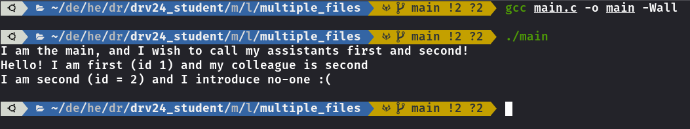
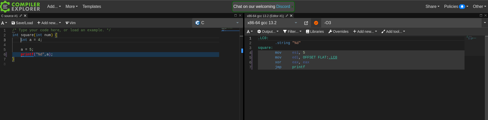
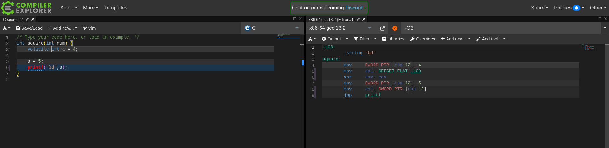

## Lab 00 DRV - André Costa

## Include Guards

Ici le problème est que `main.c` inclut le fichier `first.h`.
Ensuite le fichier `first.h`inclut le fichier `second.h` qui essaie à sont tour d'inclure `first.h` ce qui cause des inclusions récursives.

Pour résoudre cela, on peut ajouter des include guards.

```c
//first.h
#ifndef FIRST_H
#define FIRST_H

#include <stdio.h>
#include "second.h"

...

#endif
```

```c
//second.h
#ifndef SECOND_H
#define SECOND_H

#include <stdio.h>
#include "first.h"

...

#endif
```

Resultat:



## Sizeof

Les tailles sont différentes car lorsqu'on passe `str_out` dans print_size, on passe le pointeur vers le premier caractère de la chaîne de caractères

Pour y remédier, on peut utiliser la fonction `strlen` pour avoir la taille de la chaîne de caractères.

Dans le cas où l'on travaille avec un autre type de tableaux, la taille du tableau doit être passé en paramètre à la fonction.

## Pointeurs

On affiche d'abord le byte le moins significatif.
On est donc en little endian

## Programmation OOP

Car il n'est pas possible de modifier la fonction `moveTo` pour prendre un paramètre de plus.

```c
struct ParallelipedeRectangle {
   struct Rectangle super;
   int z;
};

double ParallelipedeRectangle_calculateVolume (struct Shape* obj)
{
    struct ParallelipedeRectangle* pr = (struct ParallelipedeRectangle*) obj;

    return pr->super.x * pr->super.y * pr->z;
}

struct ParallelipedeRectangleFuncTable {
	struct RectangleFuncTable super;
	double (*calculateVolume) (struct Shape *obj);
} parallelipedeRectangleFunctTable = {
    {{
    		 .printArea = Rectangle_printArea,
			 .moveTo = Rectangle_moveTo,
			 .destructor_ = Rectangle_destroy
			},
			.setWidth = Rectangle_setWidth
    },
    .calculateVolume = ParallelipedeRectangle_calculateVolume
    };
struct Shape* ParallelipedeRectangle_init(int initx, int inity, int initz, int inith, int initw)
{
    struct ParallelipedeRectangle* obj = malloc(sizeof(struct ParallelipedeRectangle));
    __Rectangle_init(&(obj->super),initx,  inity,  initw, inith);
    obj->z = initz;
    obj->super.super.funcTable = (struct ShapeFuncTable*) &parallelipedeRectangleFunctTable;
    return (struct Shape*) obj;
}

```

## struct

Oui. Premier cas on crée seulement la structure sans initialiser. Donc 0 bytes pris en mémoire
Deuxième cas on a une structure anonyme sur laquelle on initialise un objet de ce type.

## Compiler Attributes

Avec

```bash
git grep "__attribute__" -- '*.h'
```

on peut voir les utilisations de `__attribute__`.

Il y en a beaucoup, les deux qui ressortent le plus sont `__aligned__` et `packed`

Aligned dira au compilateur de comment aligner les attributs dans le struct.

Packed dira au compilateur de avoir le plus petit alignement possible.

## ContainerOf

```c
#include <stdio.h>
#include <stddef.h>

#define container_of(ptr, type, member) \
    (type *)(void *)((char *)ptr - offsetof(type, member))

typedef struct
{
    int a;
    char c;
    int b;
} __attribute__((__packed__))
s_t;
int main(int argc, char **argv)
{
    s_t s = {.a = 1, .b = 2, .c = 'a'};
    int *p = &s.b;
    s_t *ps = container_of(p, s_t, b);
    printf("%d %d %c\n", ps->a, ps->b, ps->c);
}
```

Prendre un pointeur sur une variable non alignée est dangereux et c'est pour cela que nous avons un warning.

Cependant, le offsetof marche toujours et donc le containerof aussi.

## Union

```c
union i2c_smbus_data
```

est utilisé pour pouvoir avoir le même nom dans les plusieurs types de transactions i2c (1 byte) (1 word), etc...

## Volatile

Sans volatile, il ignore une affectation



Avec volatile, il fait les deux affectations


