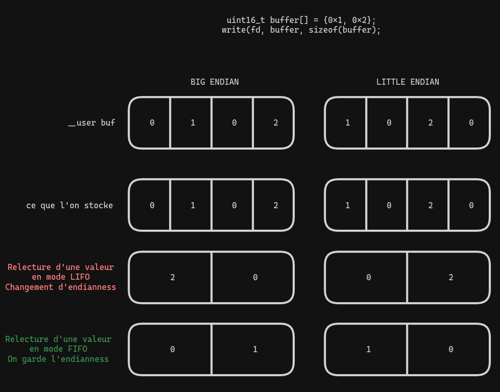
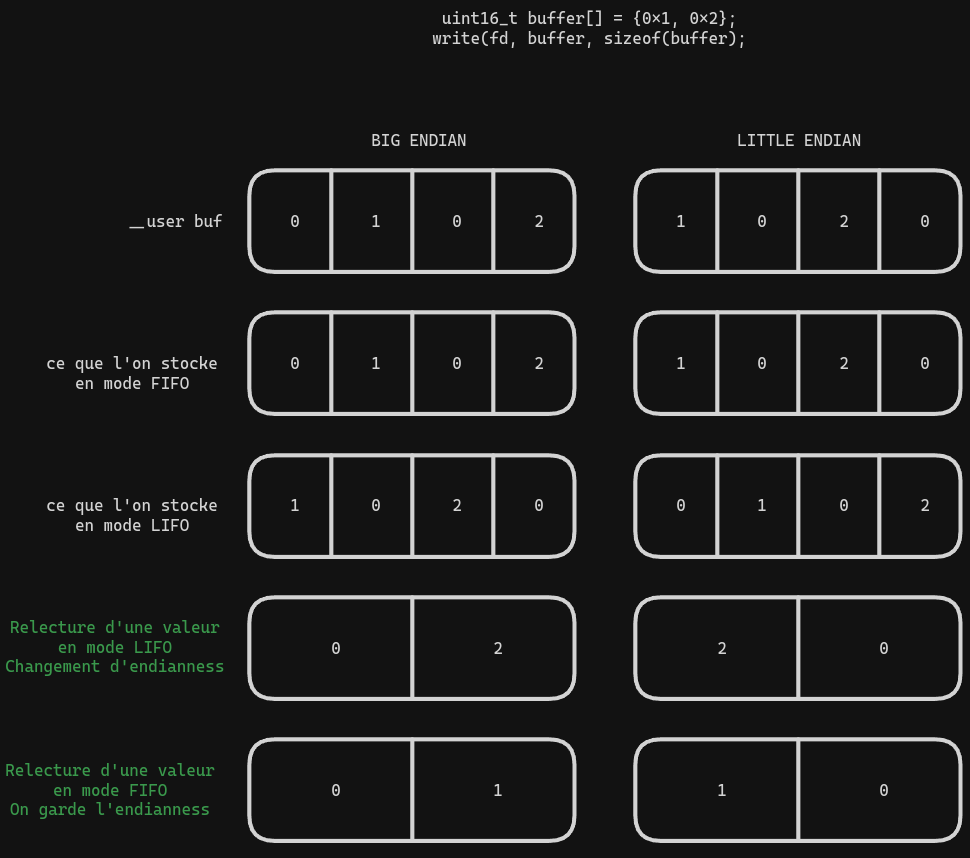

# Laboratoire 3 - DRV

#### André Costa

# Exercice 1

```shell
# man mknod
MKNOD(1)                                                               User Commands                                                              MKNOD(1)

NAME
       mknod - make block or character special files

SYNOPSIS
       mknod [OPTION]... NAME TYPE [MAJOR MINOR]

DESCRIPTION
       Create the special file NAME of the given TYPE.

       Mandatory arguments to long options are mandatory for short options too.

       -m, --mode=MODE
              set file permission bits to MODE, not a=rw - umask

       -Z, --context=CTX
              set the SELinux security context of NAME to CTX

       --help display this help and exit

       --version
              output version information and exit

       Both  MAJOR  and MINOR must be specified when TYPE is b, c, or u, and they must be omitted when TYPE is p.  If MAJOR or MINOR begins with 0x or 0X,
       it is interpreted as hexadecimal; otherwise, if it begins with 0, as octal; otherwise, as decimal.  TYPE may be:

       b      create a block (buffered) special file

       c, u   create a character (unbuffered) special file

       p      create a FIFO

```

Pour créer un fichier virtuel de type caractère on peut utiliser:

```shell
mknod -m <MODE> <NAME> c <MAJOR> <MINOR>
```

Pour savoir la valeur de MAJOR et MINOR de `/dev/random` on peut utiliser:

```shell
ls -l /dev/random
crw-rw-rw- 1 root root 1, 8 Jan  1 00:00 /dev/random
```

Le couple MAJOR MINOR est `1, 8`.

Pour le mode, on peut aussi utiliser le même mode que `/dev/random`:

Le mask correspondant à `rw-rw-rw-` est 0666 en octal.

Je nomme mon device `mondev`.

La commande finale devient donc:

```shell
mknod -m 0666 /dev/mondev c 1 8
```

En utilisant `ls -l /dev/mondev` on peut voir que le fichier a été créé.

```shell
# ls -l /dev/mondev
crw-rw-rw- 1 root root 1, 8 Jan  1 00:13 /dev/mondev
```

Vu que le major et le mineur sont les mêmes que `/dev/random`, le même driver s'occupera de notre device.
En l'utilisant on peut voir que nous avons des valeurs aléatoires.

```shell
# cat /dev/mondev
�xe��Կ�<X�(k7�����֒O�:+���ٷ
@N|��^CFu�.������f�+ұLH8E	s�� 0�5j1u�X��R�v
```

# Exercice 2

```shell
$ cat /proc/devices | grep 188
188 ttyUSB
```

# Exercice 3

```shell
$ find /sys -name "ttyUSB0"
/sys/devices/pci0000:00/0000:00:14.0/usb1/1-4/1-4:1.0/ttyUSB0
/sys/devices/pci0000:00/0000:00:14.0/usb1/1-4/1-4:1.0/ttyUSB0/tty/ttyUSB0
/sys/bus/usb-serial/devices/ttyUSB0
/sys/bus/usb-serial/drivers/ftdi_sio/ttyUSB0
```

En reprenant le premier chemin, on peut voir que le driver utilisé est `ftdi_sio`.

```shell
$ ll /sys/devices/pci0000:00/0000:00:14.0/usb1/1-4/1-4:1.0/ttyUSB0
total 0
lrwxrwxrwx 1 root root    0 Apr 10 10:50 driver -> ../../../../../../../bus/usb-serial/drivers/ftdi_sio # Driver utilisé
--w------- 1 root root 4.0K Apr 10 11:04 event_char
-rw-r--r-- 1 root root 4.0K Apr 10 11:04 latency_timer
-r--r--r-- 1 root root 4.0K Apr 10 10:50 port_number
drwxr-xr-x 2 root root    0 Apr 10 11:02 power
lrwxrwxrwx 1 root root    0 Apr 10 10:50 subsystem -> ../../../../../../../bus/usb-serial
drwxr-xr-x 3 root root    0 Apr 10 10:50 tty
-rw-r--r-- 1 root root 4.0K Apr 10 10:50 uevent
```

Et avec lsmod on peut voir que le module `ftdi_sio` est bien chargé.

```shell
lsmod
Module                  Size  Used by
ftdi_sio               69632  0
usbserial              69632  1 ftdi_sio
```

Et on voit que le driver `ftdi_sio` utilise le module `usbserial`.

# Exercice 4

Après avoir modifié la fonction `empty_exit` pour qu'elle utilise la fonction `pr_info` à la place de `pr_debug`

```c
static void __exit empty_exit(void)
{
    //pr_debug("Good bye!\n");
	pr_info("Good bye!\n");
}
```

On voit les deux messages dans les logs:

```shell
$ make
$ sudo insmod empty.ko
$ sudo dmesg | tail -n 1
[10274.107881] Hello there!
$ sudo rmmod empty
$ dmesg | tail -n 2
[10274.107881] Hello there!
[10315.914668] Good bye!
```

# Exercice 5

- Lancer le driver `flifo` avec `insmod`

```shell
$ sudo insmod flifo.ko
```

- Crée un device avec `mknod` avec le major `97` pour que le driver `flifo` s'en occupe.

```shell
$ sudo mknod -m 0666 /dev/mynode c 97 0
$ ls -la /dev/mynode
crw-rw-rw- 1 root root 97, 0 Apr 10 11:36 /dev/mynode
```

- Lecture et écriture dans le device

```shell
$ echo "1" >> /dev/mynode
$ echo "2" >> /dev/mynode
$ cat /dev/mynode
1%
$ cat /dev/mynode
2%
```

- Changement de Mode

- Le 1074014977 a été trouvé dans `dmesg` et indique CHANGE_MODE,
- Le 1 dans flifo.h et est utilisé pour changer en mode LIFO

```shell
$ ./ioctl /dev/mynode 1074014977 1
$ echo "1" >> /dev/mynode
$ echo "2" >> /dev/mynode
$ cat /dev/mynode
2%
$ cat /dev/mynode
1%
```

- Déchargement du device

```shell
$ sudo rmmod flifo
$ sudo dmesg
[11645.484760] FLIFO ready!
[11645.484763] ioctl FLIFO_CMD_RESET: 11008
[11645.484764] ioctl FLIFO_CMD_CHANGE_MODE: 1074014977
[12728.868418] FLIFO done!
```

## Modérnisation du code

- Pour la modérnisation du code, je m'enregistre dans la plateforme misc.

```c
const static struct file_operations flifo_fops = {
	.owner = THIS_MODULE,
	.read = flifo_read,
	.write = flifo_write,
	.unlocked_ioctl = flifo_ioctl,
};
static struct miscdevice flifo_miscdev = {
	.minor = MISC_DYNAMIC_MINOR,
	.name = DEVICE_NAME,
	.fops = &flifo_fops,
};
static int __init flifo_init(void)
{
	next_in = 0;
	nb_values = 0;
	mode = MODE_FIFO;

	//	register_chrdev(MAJOR_NUM, DEVICE_NAME, &flifo_fops);
	int ret = misc_register(&flifo_miscdev);
	pr_info("FLIFO ready!\n");
	pr_info("ioctl FLIFO_CMD_RESET: %u\n", FLIFO_CMD_RESET);
	pr_info("ioctl FLIFO_CMD_CHANGE_MODE: %lu\n", FLIFO_CMD_CHANGE_MODE);

	return 0;
}
static void __exit flifo_exit(void)
{
	//unregister_chrdev(MAJOR_NUM, DEVICE_NAME);
	misc_deregister(&flifo_miscdev);
	pr_info("FLIFO done!\n");
}
```

- Une fois ces changements effectués, lors de l'insertion du module, on peut voir le fichier `/dev/flifo` est créé automatiquement.

```shell
ls -la /dev/flifo
crw------- 1 root root 10, 119 avr 10 22:01 /dev/flifo
```

Pour éviter de devoir faire un sudo à chaque fois que je veux écrire dans le fichier, je peux changer les permissions du fichier.

```shell
sudo chmod 666 /dev/flifo
```

## Modifications pour utiliser des valeurs binaires

Vu que je sens qu'on va passer pas mal de temps dessus, un petit script pour builder et insérer le module.

`build_and_run.sh`:

```shell
#!/bin/bash

make
rmmod flifo
insmod flifo.ko && chmod 666 /dev/flifo
```

Bien sûr à être lancé avec `sudo`.

Après avoir été challengé par le prof pour que les valeurs dans la liste puissent avoir des tailles différentes, le code a été modifié en conséquence.

D'abord l'ajout de l'entrée ioctl pour pouvoir modifier la taille.

Le define dans `flifo.h`:

```c
#define FLIFO_CMD_CHANGE_VALUE_SIZE _IOW(FLIFO_IOC_MAGIC, 2, int)
```

Le code dans `flifo.c`:

```c
static int is_size_valid(unsigned long arg)
{
	int possible_values[] = { 1, 2, 4, 8 };
	ssize_t size = sizeof(possible_values) / sizeof(possible_values[0]);
	for (int i = 0; i < size; ++i) {
		if (possible_values[i] == arg) {
			return 1;
		}
	}
	return 0;
}

static long flifo_ioctl(struct file *filp, unsigned int cmd, unsigned long arg)
{
...
	case FLIFO_CMD_CHANGE_VALUE_SIZE:
		if (!is_size_valid(arg)) {
			pr_err("Invalid value size\n");
			return -1;
		}
		value_size = arg;
		DBG("Value size changed to %lu\n", value_size);
		pr_info("Resetting list\n");
		reset_list();
		break;
...
}
```

Pour garder les valeurs, on peut utiliser un tableau `uint8_t`

```c
static size_t value_size; // Size of the integer value
static size_t value_count; // Number of values in the list
static uint8_t values[NB_VALUES]; // List of values
```

Avec ceci la gestion des valeurs devient plus complexe.
En effet, la gestion de la liste en mode LIFO n'est plus aussi simple qu'avant lorsque les valeurs occupent plus qu'un byte.

Voici pourquoi:

Si l'utilisateur veut ajouter deux valeurs de 2 bytes: 0x01 et 0x02

En big endian on recevra un buffer de 4 bytes: [0x00, 0x01, 0x00, 0x02]

Et on stockera ces valeurs dans la liste comme suit: [0x00, 0x01, 0x00, 0x02]

Maintenant si on essaye de lire une valeur, en mode LIFO on lira [0x02, 0x00]
Et donc on aura changé l'endianness de la valeur.

La même chose se passe en little endian.

On recevra [0x01, 0x00, 0x02, 0x00] et on stockera [0x01, 0x00, 0x02, 0x00]

Et en mode LIFO on lira [0x00, 0x02]

Donc de nouveau, on aura changé l'endianness de la valeur.

Ceci n'arrive pas en mode FIFO:

En big endian on recevra [0x00, 0x01, 0x00, 0x02] et on stockera [0x00, 0x01, 0x00, 0x02]
En relisant, on part de la première valeur donc on lira [0x00, 0x01]

En little endian on recevra [0x01, 0x00, 0x02, 0x00] et on stockera [0x01, 0x00, 0x02, 0x00]
En relisant, on part de la première valeur donc on lira [0x01, 0x00]

Donc en FIFO, on peut lire les valeurs dans le même ordre qu'on les a écrites, ceci ne pose pas de problème.
Voici une image illustrant le problème:



Pour résoudre cela, on peut inverser l'endianness lorsque l'on écrit dans la liste.

Lors que l'on lit la liste, on va renverser l'endianness des valeurs et finir par retourner dans l'ordre original.



```c
static void write_to_list(uint8_t *buffer, size_t count, uint8_t *dst,
			  size_t size)
{
	const size_t nb_values = count / size;
	switch (mode) {
	case MODE_FIFO:
		for (size_t i = 0; i < count; i++) {
			dst[next_in] = buffer[i];
			next_in = (next_in + 1) % NB_VALUES;
			value_count++;
		}
		break;
	case MODE_LIFO:
		//Here we need to write each value in reverse order
		// so that when we read them back we get the original order
		//eg: size = 2 and user sends us 0x01 0x02
		//we need to store them as 0x10 0x20 so that
		// when we read the bytes back we retrieve 0x02 0x01 (lifo order)
		for (size_t i = 0; i < nb_values; ++i) {
			for (size_t j = size; j > 0; --j) {
				size_t src_index = i * size + j - 1;
				dst[next_in] = buffer[src_index];
				next_in = (next_in + 1) % NB_VALUES;
				value_count++;
			}
		}
	default:
		break;
	}
}
```

Une fois ceci fait, on doit juste gèrer les écritures multiples et lectures multiples.
Et bien sûr, ne plus convertir les valeurs comme si elles était représentées en ascii.

```c

static ssize_t flifo_read(struct file *filp, char __user *buf, size_t count,
			  loff_t *ppos)
{
	if (buf == NULL || count % value_size != 0 || count > value_count) {
		return 0;
	}
	DBG("Reading %lu values\n", count / value_size);
	//create a temporary buffer to stock the data
	uint8_t *buffer = kmalloc(count, GFP_KERNEL);

	if (!buffer) {
		return 0;
	}

	// This a simple usage of ppos to avoid infinit loop with `cat`
	// it may not be the correct way to do.
	if (*ppos != 0) {
		return 0;
	}
	*ppos = 0;

	// Read the values from the list 1 byte at a time
	// Can't use memcpy because may not be contiguous depending
	// on where we are on our circular buffer
	// Also we can't use memcpy if we are in LIFO mode
	for (size_t i = 0; i < count; ++i) {
		uint8_t value;
		// Read the value from the list using correct mode.
		switch (mode) {
		case MODE_FIFO:
			value = values[(NB_VALUES + next_in - value_count) %
				       NB_VALUES];
			break;
		case MODE_LIFO:
			value = values[next_in - 1];
			break;
		default:
			return 0;
		}
		// Store the value in our buffer
		buffer[i] = value;

		// Update the next_in and value_count
		--value_count;
		if (mode == MODE_LIFO) {
			--next_in;
		}
	}

	for (size_t i = 0; i < count; i++) {
		DBG("Buffer[%lu] = %u\n", i, buffer[i]);
	}
	// Copy our buffer to the user space buffer
	if (copy_to_user(buf, buffer, count) != 0) {
		kfree(buffer);
		return 0;
	}
	DBG("Read Ok, next_in: %lu\n", next_in);
	kfree(buffer);
	return count;
}

static ssize_t flifo_write(struct file *filp, const char __user *buf,
			   size_t count, loff_t *ppos)
{
	if (count == 0 || count % value_size != 0 ||
	    value_count + count > NB_VALUES) {
		return 0;
	}
	DBG("Writing %lu values\n", count / value_size);
	*ppos = 0;
	uint8_t *buffer;

	buffer = kmalloc(count, GFP_KERNEL);

	if (!buffer) {
		return 0;
	}

	// Get the value and convert it to an integer.
	if (copy_from_user(buffer, buf, count) != 0) {
		kfree(buffer);
		return 0;
	}
	for (size_t i = 0; i < count; i++) {
		DBG("Buffer[%lu] = %u\n", i, buffer[i]);
	}
	write_to_list(buffer, count, values, value_size);

	DBG("Write Ok, next_id %lu\n", next_in);
	kfree(buffer);
	return count;
}
```

Le code complet peut etre trouvé dans le fichier [`flifo.c`](./flifo_module/flifo.c).

## Compilation

### Natif

Pour compiler le module, il suffit de lancer la commande `make` dans le dossier `flifo_module`.

```shell
make
```

### Cross-compilation

Pour cross-compiler le module, il suffit de lancer la commande `make` dans le dossier `flifo_module` en spécifiant la variable `CROSS_COMPILE` avec le préfixe de l'outil de cross-compilation.

```shell
make CROSS_COMPILE=arm-linux-gnueabihf- ARCH=arm
```

## Tests

Un script de test a été créer pour tester les différentes fonctionnalités du module.

Il est disponible [ici](./flifo_test.c)

Pour le compiler:

```shell
gcc flifo_test.c -Wall -Wextra -o flifotest
```

Et pour l'utiliser:

```shell
./flifotest
```

J'utilise une macro pour générer les fonctions de test pour les différentes tailles de valeurs.

```c
#define CREATE_TEST_FUNCTION(type)                                     \
	int test_##type(int fd)                                        \
	{                                                              \
		type values[] = { 1, 2, 3, 4 };                        \
		size_t nb_values = sizeof(values) / sizeof(values[0]); \
                                                                       \
		if (set_value_size(fd, sizeof(type)) < 0) {            \
			perror("set_value_size:");                     \
			return -1;                                     \
		}                                                      \
		write(fd, values, nb_values * sizeof(type));           \
                                                                       \
		for (size_t i = 0; i < nb_values; i++) {               \
			if (read_and_check_value(fd, values[i],        \
						 sizeof(type)) < 0) {  \
				return -1;                             \
			}                                              \
		}                                                      \
		if (set_mode(fd, MODE_LIFO) < 0) {                     \
			perror("set_mode:");                           \
			return -1;                                     \
		}                                                      \
		write(fd, values, nb_values * sizeof(type));           \
                                                                       \
		for (size_t i = nb_values; i > 0; i--) {               \
			if (read_and_check_value(fd, values[i - 1],    \
						 sizeof(type)) < 0) {  \
				return -1;                             \
			}                                              \
		}                                                      \
                                                                       \
		return 0;                                              \
	}

CREATE_TEST_FUNCTION(uint8_t);
CREATE_TEST_FUNCTION(uint16_t);
CREATE_TEST_FUNCTION(uint32_t);
CREATE_TEST_FUNCTION(uint64_t);
```

## Améliorations

- Ajouter une meilleure gestion des erreurs
  - Pour l'instant je ne fais que retourner 0 mais il faudrait retourner une valeur négative et utiliser errno pour donner plus d'informations sur l'erreur. Vu que ceci n'est pas demandé et la théorie n'est pas encore vue, je ne l'ai pas fait.

# Conclusion

En résumé, ce rapport a exploré divers aspects de la manipulation des périphériques sous Linux. Des commandes système de base à la modification de pilotes existants et à la création d'un pilote personnalisé, nous avons parcouru un large éventail de sujets.

Chaque exercice a offert des défis uniques et des apprentissages précieux, mettant en lumière l'importance de comprendre les mécanismes sous-jacents du système d'exploitation pour réussir dans le développement de pilotes de périphériques.

La mise en œuvre du pilote `flifo` a été particulièrement instructive, démontrant les nuances de la création d'un driver et la flexibilité offerte par le framework MISC.
